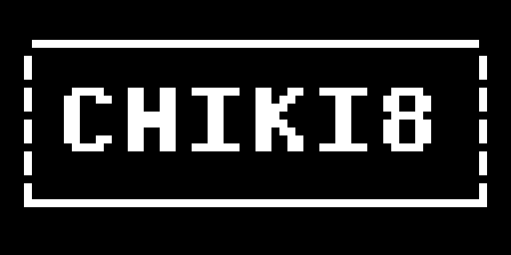

# chiki8

[](https://github.com/frogiraffe/chiki8/actions/workflows/ci.yml)
[](LICENSE)
[](https://www.rust-lang.org/)

A configurable desktop CHIP-8 and SUPER-CHIP emulator built with Rust and SDL2.



## Highlights

- Classic CHIP-8 and SUPER-CHIP 1.1 support
- Configurable pixel scale, colors, speed, volume, and key mapping
- TOML configuration with CLI overrides
- Comprehensive unit and integration test suite

## Prerequisites

- A stable Rust toolchain
- SDL2 development libraries

See [Getting Started](docs/GETTING-STARTED.md) for platform-specific setup instructions.

## Quick start

1. Build the emulator:

   ```bash
   cargo build --release
   ```

2. Run a CHIP-8 ROM:

   ```bash
   cargo run --release -- -f path/to/game.ch8
   ```

## Usage

```text
cargo run --release -- -f <rom_file> [options]

-f, --file FILE          ROM file (required)
-s, --scale SCALE        Pixel scale (default: 15)
-p, --speed SPEED        CPU cycles per frame (default: 10)
-v, --volume VOLUME      Volume from 0 to 100 (default: 25)
-b, --background COLOR   Background color as R,G,B (default: 0,0,0)
-c, --color COLOR        Foreground color as R,G,B (default: 255,255,255)
    --profile PROFILE    Emulation profile: classic or superchip-1.1 (default: classic)
    --refresh HZ         Display refresh rate: 30, 60, or 120 (default: 60)
    --filter FILTER      Texture filter: nearest or linear (default: nearest)
    --integer-scaling    Use native SDL integer scaling (off by default)
    --config PATH        TOML configuration path
    --create-config      Write an example chiki8.toml
    --help               Show help
```

Examples:

```bash
# Green pixels at 20× scale
cargo run --release -- -f path/to/game.ch8 -s 20 -c 0,255,0

# Run in SUPER-CHIP mode
cargo run --release -- -f path/to/game.ch8 --profile superchip-1.1

# Use a custom configuration file
cargo run --release -- -f path/to/game.ch8 --config configs/fast.toml

# Generate a starter configuration file
cargo run -- --create-config
```

## Keyboard

```text
CHIP-8           Keyboard
1 2 3 C          1 2 3 4
4 5 6 D          Q W E R
7 8 9 E          A S D F
A 0 B F          Z X C V
```

Press `Esc` or close the window to exit. Key assignments can be changed in TOML; see [Configuration](docs/CONFIGURATION.md).

## Profiles

- **`classic`** (default): Standard modern CHIP-8 implementation (64×32 display, standard font, edge wrapping).
- **`superchip-1.1`**: SUPER-CHIP 1.1 legacy profile (supports 64×32 low-res and 128×64 high-res modes, 16×16 sprites, high-res font glyphs, scrolling, and RPL flags).

Profile selection precedence: `--profile` CLI flag > `chiki8.toml` setting > default (`classic`).

## Development

```bash
cargo fmt --check
cargo test
cargo clippy --all-targets --all-features -- -D warnings
```

## License

Licensed under the [MIT License](LICENSE).
